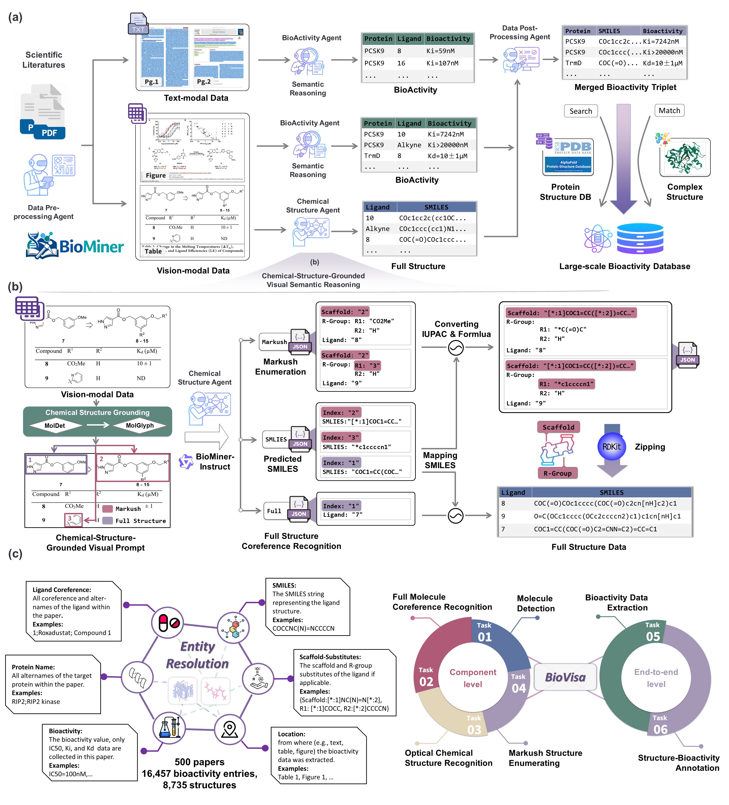
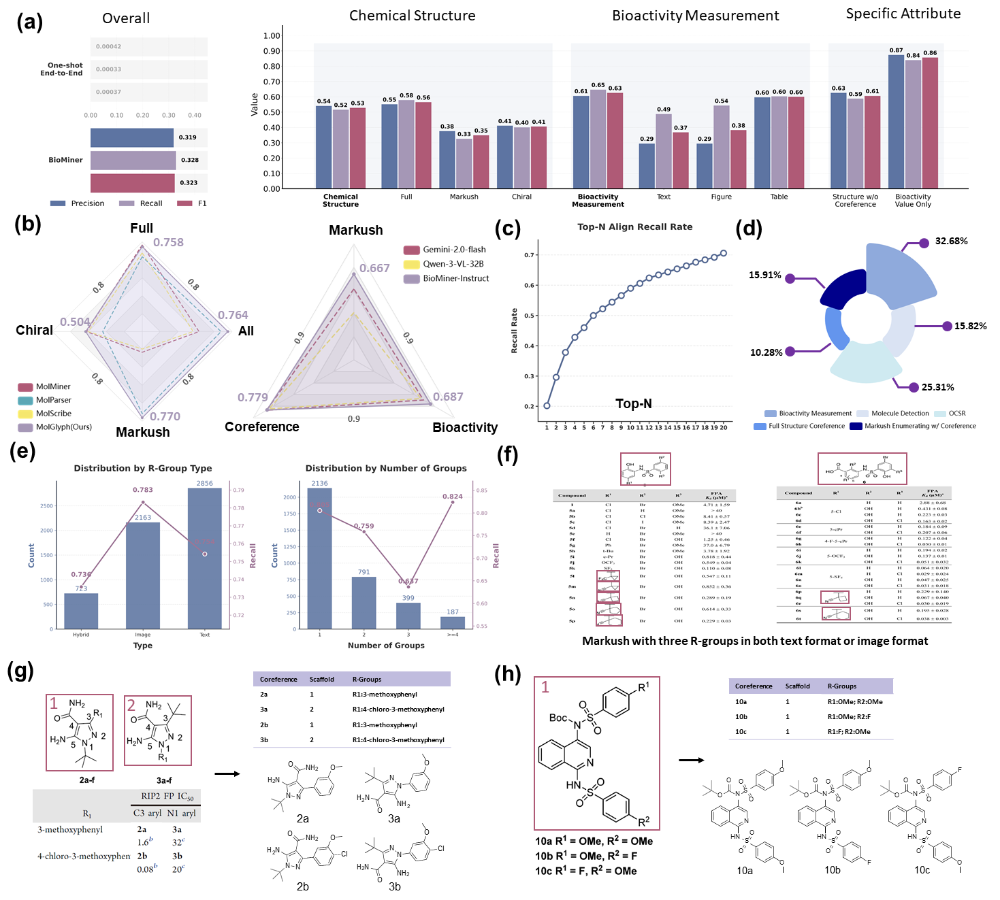
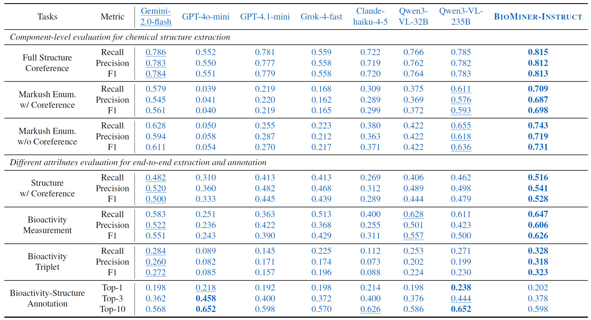

# BioMiner: A Multi-modal System for Automated Mining of Protein-Ligand Bioactivity Data from Literature

## Changelog
- 2025/12/27 BioMiner Upgrade Version Release
    - **Biotriplet extraction F1 score increases to 0.32**
    - Releasing open-weight OCSR model **MolGlyph** (SOTA on BioVista)
    - Releasing open-weight MLLM Model **BioMiner-Instruct**
    - Splitting Benchmark into **validation set and testing set** in a 1:9 ratio
    - Introducing **text normalization** for more faithful and robust evaluation
    - Improving cache mechanism of IUPAC OPSIN
    - Supporting multi-gpu inference for all processes

- 2025/4/23 BioMiner Initial Version Release
    - Biotriplet extraction F1 score 0.22

## Introduction
This is the official implement for paper [BioMiner: A Multi-modal System for Automated Mining of Protein-Ligand Bioactivity Data from Literature](https://www.biorxiv.org/content/10.1101/2025.04.22.648951v1).
If you encounter any issues, please reach out to jiaxianyan@mail.ustc.edu.cn.

- We introduce **BioMiner**, a multi-modal system integrating multi-modal large language models (MLLMs), domain-specific models (DSMs), and domain tools (DTs) to automatically extract protein-ligand-bioactivity triplets from thousands to potentially millions of publications at high throughput (about 20 seconds/paper on 4 A800 80G GPUs). 

- To evaluate extraction capabilities and support method development, we establish a new benchmark **BioVista**, containing 16,457 bioactivity and 8,735 structures manually collected from 500 publications. To our knowledge, **BioVista** is the largest benchmark dedicated to protein-ligand bioactivity extraction.

### Overview of BioMiner and BioVista
- BioMiner integrates four specialized agents-data preprocessing, chemical structure extraction, bioactivity measurement extraction, and data postprocessing—working collaboratively to address the complicated bioactivity extraction task.

- BioVista is derived from 500 recent publications referenced in PDBbind v2020, defining two end-to-end tasks and four component-level tasks to thoroughly assess the extraction performance of BioMiner



### BioMiner's Performance on BioVista
BioMiner achieves recall rates of 0.32 for bioactivity triplet (protein-SMILES-bioactivity value). **Notably, its Markush enumeration capability achieves an F1 score of 0.70.**
More detailed analysis result are shown in the figure.




## Statistics and Access of BioVista
BioVista defines two end-to-end tasks and four component-level tasks to thoroughly assess the extraction performance of BioMiner.

The two end-to-end tasks evaluate overall extraction capability, specifically: 
- (1) extracting all bioactivity data reported in a publication;
- (2) annotating PDB structures with bioactivity information presented in associated papers. 

Additionally, four specialized component-level tasks provide deeper insights into the performance of critical **chemical structure extraction**, facilitating method development and optimization: 
- (3) molecule detection;
- (4) optical chemical structure recognition (OCSR);
- (5) full-structure coreference recognition;
- (6) Markush structure enumeration.

Downloading BioVista according to the following links, and unzip them in the `./BioVista` directory.

**Note 1**: Due to the copyright, for paper pdfs, we only give the pdb name of these 500 papers. You can download corresponding papers based on PDB's paper title.

**Note 2**: Due to the copyright, for augmented images used for full structure corefernece recognition and Markush enumeration, we only provide the codes to generate augmented images based on pdfs. After downloading all pdfs, you can generate the augmented images based on our codes.

**Note 3**: More details can be found in [here](./BioVista/)

| **Tasks**    | **Metrics** | **Input** | **Ground-truth Labels** | **Download** |
| ----------- | ----------- | ----------- | ----------- | ----------- | 
|  Bioactivity Triplet Extraction | F1, Precision, Recall | 500 Papers | 16,457 bioactivity | [Link](https://drive.google.com/file/d/14icAlg_jEy3uE7FOcDD-EYn3UIKQxC__/view?usp=drive_link) | 
|  Structure-Bioactivity Annotation | Recall@N | 500 structure-paper pairs |  500 structure-bioactivity pairs | [Link](https://drive.google.com/file/d/1cLC3NePtxctIurnCVaNLw0JzBWYrWTVW/view?usp=drive_link) | 
|  Molecule Detection | Average Precision | 500 Papers | 11,212 boundary boxes  | [Link](https://drive.google.com/file/d/1SvsdgrizDqg5V-MGXEPGMmu4JmmhiFae/view?usp=drive_link) | 
|  OCSR | precision | 8,861 2D molecule structure depictions | 8,861 SMILES  | [Link](https://drive.google.com/file/d/11iCH0j7U9iFgwXahjkWZouNyqATfEPoL/view?usp=drive_link) | 
|  Full Structure Coreference Recognition | F1, Precision, Recall | 962 Augmented Images | 5,105 full structure-coreference pairs | [Link](https://drive.google.com/file/d/14_BREaWgJOIjgVAkCEMwbXKRKsmqpTgu/view?usp=drive_link) | 
|  Markush Enumeration | F1, Precision, Recall | 355 Augmented Images | 3,513 Markush Scaffold-R Group-Coreference Pairs | [Link](https://drive.google.com/file/d/19WrleiHQY6v6srZEWlKvl-uPlx0wiaLa/view?usp=drive_link) | 

## Statistics and Access of BioMiner Constructed Database
With BioMiner, we construct three databases, namely the EJMC bioactivity database, NLRP3 bioactivity database, and PoseBuster structure-bioactivity database.

You can directly download them for your own use.

| **Database**    | **Workflow** | **Data Points** | **Download** |
| ----------- | ----------- | ----------- | ----------- | 
|  EJMC | Fully Automated | 67,953 bioactivity data  | [Link](https://drive.google.com/file/d/1fSdBI_ARkQ80oi3eyboX7nq45LlbaP5o/view?usp=drive_link) | 
|  NLRP3 | Human-in-the-loop | 1,598 NLRP3 bioactivity data | [Link](https://drive.google.com/file/d/1h3lQ6cHiG_M4HPMVi7FpYuPmywhAXgID/view?usp=drive_link) | 
|  PoseBuster | Human-in-the-loop | 242 structure-bioactivity pairs  | [Link](https://drive.google.com/file/d/1LLaoxrTt61fWoPtBE1UMMhHhUy0XP0nY/view?usp=drive_link) | 


## Installation of BioMiner

BioMiner coordinates MLLMs (BioMiner-Instruct), DSMs (MolDetv2, MolGlyph), and DTs (RDKit, OPSIN) together. All of them are open-weight models. 

- **MolDetV2**: Download the model weight from DP Tech Team's [HuggingFace Repo](https://huggingface.co/UniParser/MolDetv2). Saving the model weight as `scripts/moldet_v2_yolo11n_960_doc.pt`
- **MolGlyph**: Download the model weight from our [HuggingFace Repo](https://huggingface.co/jiaxianustc/MolGlyph). Saving the model weight as `scripts/molglyph_large.pt`
- **BioMiner-Instruct**: Download the model weight from our [HuggingFace Repo](https://huggingface.co/jiaxianustc/BioMiner-Instruct). Saving the model weight to the directory `scripts/local-biominer-instruct`

Performance of these models on BioVista:

- Molecule Detection Performance:

|Metrics | YOLO | MolDet | MolMiner  | **MolDetV2** |
| ----------- | ----------- | ----------- | ----------- | ----------- | 
|mAP | 0.648 | 0.778 | **0.878** |  0.747 |
|AP50 | 0.846 | 0.910 | 0.899 | **0.922** |
|AP75 | 0.752 | 0.851 | **0.876** |  0.851 |
|AP-Small | 0.000 | 0.034 | 0.000 |  **0.050** |

- OCSR Performance:

Structure Types | MolMiner | MolScribe | MolNexTR | DECIMER |**MolParser** | **MolGlyph (Ours)** |
| ----------- | ----------- | ----------- | ----------- | ----------- | ----------- | ----------- |
Full | **0.774** | 0.703 | 0.695 | 0.545 | 0.669 | 0.758 |
Chiral | 0.497 | 0.481 | 0.419 | 0.326 | 0.352 | **0.504** |
Markush | 0.185 | 0.156 | 0.045 | 0.000 | 0.733| **0.770** |
All | 0.507 | 0.455 | 0.401 | 0.298  | 0.703 | **0.764** |

- MLLM performance on MLLM-related tasks:




### Running Installation

We recommend to install two conda environments, one main env for running the main code, one vllm env for delopying MLLM BioMiner-Instruct using vllm.

We provide the yaml files to help install environment.

#### 1. Install main env
```
conda env create -f main_environment.yml
conda activate BioMiner

# Install MinerU. 
# Prepare MinerU config json
mv magic-pdf.json ~
# Install MinerU v1.3.1 (cpu version first)
pip3 install -U magic-pdf[full]==1.3.1 --extra-index-url https://wheels.myhloli.com
# Check if install cpu version successfully
magic-pdf --version
# for cpu version, it takes several minutes to process a pdf
magic-pdf -p small_ocr.pdf -o ./output
# Install MinerU gpu version
python3 -m pip install paddlepaddle-gpu==3.0.0b1 -i https://www.paddlepaddle.org.cn/packages/stable/cu118/
# Download MinerU model checkpoints
python download_models.py
# for gpu version, it only takes several seconds to process a pdf
magic-pdf -p small_ocr.pdf -o ./output
```

#### 2. Install vllm env
```
conda env create -f vllm_environment.yml
conda activate vllm_py310
```

## Usage of BioMiner

Our codes support users to choose MLLM they want to use.

If you want to use BioMiner-Instruct, you do not need to further modify the config file. You should deploy BioMiner-Instruct locally and **we recommend at least two A800 80G GPUs**.

Otherwise, if you want to use closed-source MLLMs through api, you should config the `api_key`, `base_url`, `text_mllm_type`, and `vision_mllm_type` in config file `BioMiner/config/default_open_source.yaml` for calling MLLM api. At this time, **you only need one GPU, such as 4090 24G**.

Due to the copyright of papers, here, we only take two open access papers as an example to show the usage:

### Start biominer server
```
# Our codes support multi-gpu inference by deploying models as servers to accelerate inference
# We run the demo experiments on 4 A800 80G GPUs
# We recommend to deploy servers at background using tools such as tmux

conda activate BioMiner
python scripts/mineru_server.py # at tmux window 0
python scripts/moldet_server.py # at tmux window 1
python scripts/ocsr_server.py # at tmux window 2 

conda activate vllm_py310
bash scripts/run_local_vllm_server_biominer_instruct.bash # at tmux window 3

```

### Run inference given a pdf file
```
python3 example_open_source.py --config_path=BioMiner/config/default_open_source.yaml --pdf=example/pdfs/68_6r8r.pdf --output_dir=./tmp_output/demo_68_6r8r
```
**Output (Top-10 lines)**:
```
   protein ligand  type  value unit                                  smiles
1    NOTUM      3  IC50     33   µM               Cc1ccccc1OCC(=O)Nc1cccnc1
17   NOTUM     19  IC50    180   µM       [H]C(Oc1ccccc1C)C(=O)N(C)c1cccnc1
18   NOTUM     20  IC50    100   µM       [H]N(C(=O)C(C)Oc1ccccc1C)c1cccnc1
19   NOTUM     34  IC50   0.27   µM       Cc1ccccc1OCC(=O)Nc1ccc2cnn(C)c2c1
20   NOTUM     38  IC50  0.032   µM   Cc1ccccc1OCC(=O)Nc1ccc2cn(C(C)C)nc2c1
21   NOTUM     39  IC50   0.12   µM       Cc1ccccc1OCC(=O)Nc1ccc2nn[nH]c2c1
22   NOTUM     45  IC50  0.085   µM         Cc1ccccc1OCC(=O)Nc1ccc2cnccc2c1
25   NOTUM     22  IC50    9.4   µM               Cc1ccccc1OCC(=O)Nc1cnccn1
26   NOTUM     24  IC50     72   µM             Cc1ccccc1OCC(=O)Nc1ccn(C)n1
27   NOTUM     26  IC50   0.21   µM       Cc1ccccc1OCC(=O)Nc1ccc2cc[nH]c2c1
...
...
```

### Run inference given a directory contains pdfs
```
python3 example_open_source.py --config_path=BioMiner/config/default_open_source.yaml --pdf=example/pdfs --output_dir=./tmp_output/demo_directy
```

### Parameter Descriptor

Both two version takes the following input:
- **config_path**, the path of config file, we provide a default config
- **pdf**, the path of the pdf file or the pdf directory. 
- **biovista_evaluate**, if the pdfs are in biovista (have labels), enable biovista evaluation
- **--output_dir**, the result output directory

## Evaluation on BioVista and Result Reproducation

### Evaluation of Two End-to-end Tasks:
- 1. Downloading the BioVista papers, and save the 450 papers of BioVista testing set in the `example/pdfs` directory
- 2. Downloading the six BioVista dataset, and unzip in the `BioVista` directory
- 3. Adding `--biovista_evaluate` in the command line, running:
```
python3 example.py --config_path=BioMiner/config/default_open_source.yaml --pdf=example/pdfs --biovista_evaluate --output_dir=./tmp/test_biovista_upgrade
```

**Output**:
```
Average recall_text_bioactivity_list: 0.4830562960974191
Average precision_text_bioactivity_list: 0.29589548767931495
Average recall_text_bioactivity_list_no_protein: 0.6303564758038762
Average precision_text_bioactivity_list_no_protein: 0.38805181750609224
Average recall_figure_bioactivity_list: 0.5681357382089308
Average precision_figure_bioactivity_list: 0.30919256809548845
Average recall_figure_bioactivity_list_no_protein: 0.6842801594972289
Average precision_figure_bioactivity_list_no_protein: 0.40317214368821697
Average recall_table_bioactivity_list: 0.6019737440361728
Average precision_table_bioactivity_list: 0.5939521865762245
Average recall_table_bioactivity_list_no_protein: 0.7291028916749461
Average precision_table_bioactivity_list_no_protein: 0.7321443648896243
Average recall_image_bioactivity_list: 0.5899963778900902
Average precision_image_bioactivity_list: 0.586570824521789
Average recall_image_bioactivity_list_no_protein: 0.7131311542370689
Average precision_image_bioactivity_list_no_protein: 0.7297628609777149
Average recall_bioactivity_list: 0.653512352416401
Average precision_bioactivity_list: 0.6136479556946058
Average recall_bioactivity_list_no_protein: 0.7775015173360614
Average precision_bioactivity_list_no_protein: 0.7765781906566901
Average recall_entire_structure_list: 0.654053438263678
Average precision_entire_structure_list: 0.6296185703847734
Average recall_entire_coreference_structure_list: 0.5760947753229779
Average precision_entire_coreference_structure_list: 0.5480348560868221
Average recall_scaffold_structure_list: 0.33877377437141565
Average precision_scaffold_structure_list: 0.38975804279410836
Average recall_scaffold_coreference_structure_list: 0.31348304880805133
Average precision_scaffold_coreference_structure_list: 0.3620019570544202
Average recall_chiral_structure_list: 0.4539893614508086
Average precision_chiral_structure_list: 0.46706463383158925
Average recall_chiral_coreference_structure_list: 0.39574313147595097
Average precision_chiral_coreference_structure_list: 0.4037041231366791
Average recall_structure_list: 0.5801183586020126
Average precision_structure_list: 0.6151265119256255
Average recall_coreference_structure_list: 0.5112721085339007
Average precision_coreference_structure_list: 0.534953576780146
Average recall_together_list: 0.328413773437506
Average precision_together_list: 0.31883580683818186
Average recall_together_list_no_protein: 0.3869810464761288
Average precision_together_list_no_protein: 0.403293035363173
Average values_recall_list: 0.8501728371941346
Average values_precision_list: 0.8865080306755284
Average values_units_recall_list: 0.8501728371941346
Average values_units_precision_list: 0.8865080306755284
Average types_values_recall_list: 0.8409485951088675
Average types_values_precision_list: 0.874716173391451
Average types_values_units_recall_list: 0.8409485951088675
Average types_values_units_precision_list: 0.874716173391451
```

### Evaluation of Four Component-level Tasks:

1. We first inference the result:
    - Molecule Detection
    ```
    # Taking YOLO as an example (BioMiner use MolDetV2)
    python3 BioVista/component_infernece/molecule_detection/moldetect_inference_batch.py
    ```

    - OCSR
    ```
    # Taking MolScribe as an example (BioMiner use MolGlyph)
    python3 BioVista/component_infernece/ocsr/molscribe_inference_batch.py
    ```

    - Full Structure Coreference Recognition
    ```
    # Run BioMiner Structure Extraction Agent
    python3 BioVista/component_infernece/full_coreference/coreference_inference_batch_with_index_split_image_layout.py
    ```

    - Markush Enumeration
    ```
    # Run BioMiner Structure Extraction Agent
    python3 BioVista/component_infernece/markush_enumerate/markush_zip_inference_batch_with_index_layout.py
    ```

2. We then evaluate the result:
```
python3 biovista_component_evaluate.py --config_path=BioVista/config/evaluate.yaml
```

## Contributors
**Student Contributors**: Jiaxian Yan*, Jintao Zhu*, Yuhang Yang, [Zaixi Zhang](https://zaixizhang.github.io/), Xukai Liu, Boyan Zhang, Kaiyuan Gao

**Supervisors**: [Qi Liu](http://staff.ustc.edu.cn/~qiliuql/), [Kai Zhang](http://home.ustc.edu.cn/~sa517494/)

**Affiliation**: State Key Laboratory of Cognitive Intelligence, USTC; Peking University; Princeton University; Huazhong University of Science and
Technology; Infinite Intelligence Pharma

## TODO
- [ ] Online web
- [ ] BioMiner pypi install
- [ ] BioMiner patent-version 
- [x] Open-source OCSR model MolGlyph
- [x] Open-srouce MLLM model BioMiner-Instruct

## Acknowledgement
We thank for Xi Fang from DP Tech for the support of [MolParser](https://arxiv.org/abs/2411.11098). 
We thank Shuaipeng Zhang from Infinite Intelligence Pharma for the support of [MolMiner](https://pubs.acs.org/doi/10.1021/acs.jcim.2c00733).

**We sincerely welcome more advanced and open-source molecule detection and OCSR methods! We are pleased to implement them within the BioMiner framework to enable better extraction performace!**

## Contact
We welcome all forms of feedback! Please raise an issue for bugs, questions, or suggestions. This helps our team address common problems efficiently and builds a more productive community. 
If you encounter any issues, please reach out to jiaxianyan@mail.ustc.edu.cn.

## License
This project is licensed under the terms of the MIT license. See [LICENSE](LICENSE) for additional details.

## Citation
If you find our work helpful, please kindly cite:
```
@article {Yan2025.04.22.648951,
	author = {Yan, Jiaxian and Zhu, Jintao and Yang, Yuhang and Liu, Qi and Zhang, Kai and Zhang, Zaixi and Liu, Xukai and Zhang, Boyan and Gao, Kaiyuan and Xiao, Jinchuan and Chen, Enhong},
	title = {BioMiner: A Multi-modal System for Automated Mining of Protein-Ligand Bioactivity Data from Literature},
	year = {2025},
	doi = {10.1101/2025.04.22.648951},
	journal = {bioRxiv}
}
```