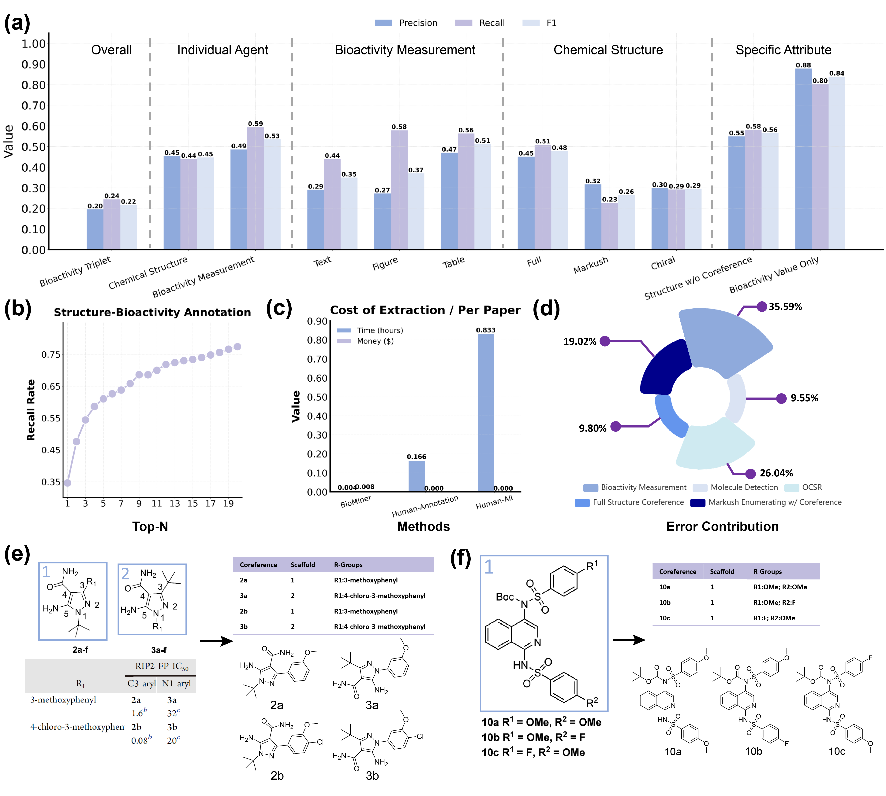
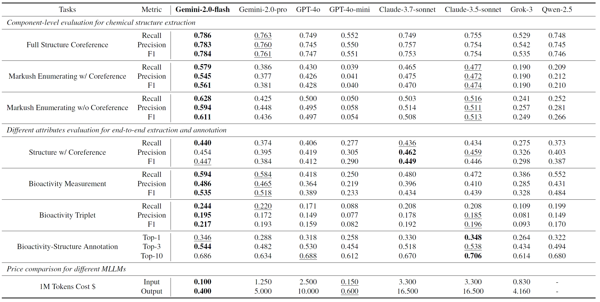

# BioMiner: A Multi-modal System for Automated Mining of Protein-Ligand Bioactivity Data from Literature
## Introduction
This is the official implement of automated protein-ligand bioactivity data extraction tool BioMiner and benchmark BioVista. If you encounter any issues, please reach out to jiaxianyan@mail.ustc.edu.cn.

- We introduce **BioMiner**, a multi-modal system integrating multi-modal large language models (MLLMs), domain-specific models (DSMs), and domain tools (DTs) to automatically extract protein-ligand-bioactivity triplets from thousands to potentially millions of publications at high throughput (about 14 seconds/paper). 

- To evaluate extraction capabilities and support method development, we establish a new benchmark **BioVista**, containing 16,457 bioactivity and 8,735 structures manually collected from 500 publications. To our knowledge, **BioVista** is the largest benchmark dedicated to protein-ligand bioactivity extraction.

### Overview of BioMiner and BioVista
- BioMiner integrates four specialized agents-data preprocessing, chemical structure extraction, bioactivity measurement extraction, and data postprocessing—working collaboratively to address the complicated bioactivity extraction task.

- BioVista is derived from 500 recent publications referenced in PDBbind v2020, defining two end-to-end tasks and four component-level tasks to thoroughly assess the extraction performance of BioMiner


### BioMiner's Performance on BioVista
BioMiner achieves recall rates of 0.24, 0.44, and 0.58 for bioactivity triplet (protein-SMILES-bioactivity value), chemical structures (ligand coreference-SMIELS), and bioactivity measurement (protein-ligand coreference-bioactivity value), respectively. **Notably, its Markush enumeration capability achieves an F1 score of 0.56.**
More detailed analysis result are shown in the figure.




## Statistics and Access of BioVista
BioVista defines two end-to-end tasks and four component-level tasks to thoroughly assess the extraction performance of BioMiner.

The two end-to-end tasks evaluate overall extraction capability, specifically: 
- (1) extracting all bioactivity data reported in a publication;
- (2) annotating PDB structures with bioactivity information presented in associated papers. 

Additionally, four specialized component-level tasks provide deeper insights into the performance of critical **chemical structure extraction**, facilitating method development and optimization: 
- (3) molecule detection;
- (4) optical chemical structure recognition (OCSR);
- (5) full-structure coreference recognition;
- (6) Markush structure enumeration.

Downloading BioVista according to the following links, and unzip them in the `./BioVista` directory.

**Note 1**: Due to the copyright, for paper pdfs, we only give the pdb name of these 500 papers. You can download corresponding papers based on PDB's paper title.

**Note 2**: Due to the copyright, for augmented images used for full structure corefernece recognition and Markush enumeration, we only provide the codes to generate augmented images based on pdfs. After downloading all pdfs, you can generate the augmented images based on our codes.

**Note 3**: More details can be found in [here](./BioVista/)

| **Tasks**    | **Metrics** | **Input** | **Ground-truth Labels** | **Download** |
| ----------- | ----------- | ----------- | ----------- | ----------- | 
|  Bioactivity Triplet Extraction | F1, Precision, Recall | 500 Papers | 16,457 bioactivity | [Link](https://drive.google.com/file/d/1xITA_Mub9u1MCZjlgs26qL_dMCrzS9Rn/view?usp=drive_link) | 
|  Structure-Bioactivity Annotation | Recall@N | 500 structure-paper pairs |  500 structure-bioactivity pairs | [Link](https://drive.google.com/file/d/1cLC3NePtxctIurnCVaNLw0JzBWYrWTVW/view?usp=drive_link) | 
|  Molecule Detection | Average Precision | 500 Papers | 11,212 boundary boxes  | [Link](https://drive.google.com/file/d/1SvsdgrizDqg5V-MGXEPGMmu4JmmhiFae/view?usp=drive_link) | 
|  OCSR | Accuracy | 8,861 2D molecule structure depictions | 8,861 SMILES  | [Link](https://drive.google.com/file/d/11iCH0j7U9iFgwXahjkWZouNyqATfEPoL/view?usp=drive_link) | 
|  Full Structure Coreference Recognition | F1, Precision, Recall | 962 Augmented Images | 5,105 full structure-coreference pairs | [Link](https://drive.google.com/file/d/14_BREaWgJOIjgVAkCEMwbXKRKsmqpTgu/view?usp=drive_link) | 
|  Markush Enumeration | F1, Precision, Recall | 355 Augmented Images | 3,513 Markush Scaffold-R Group-Coreference Pairs | [Link](https://drive.google.com/file/d/19WrleiHQY6v6srZEWlKvl-uPlx0wiaLa/view?usp=drive_link) | 

## Statistics and Access of BioMiner Constructed Database
With BioMiner, we construct three databases, namely the EJMC bioactivity database, NLRP3 bioactivity database, and PoseBuster structure-bioactivity database.

You can directly download them for your own use.

| **Database**    | **Workflow** | **Data Points** | **Download** |
| ----------- | ----------- | ----------- | ----------- | 
|  EJMC | Fully Automated | 67,953 bioactivity data  | [Link](https://drive.google.com/file/d/1fSdBI_ARkQ80oi3eyboX7nq45LlbaP5o/view?usp=drive_link) | 
|  NLRP3 | Human-in-the-loop | 1,598 NLRP3 bioactivity data | [Link](https://drive.google.com/file/d/1h3lQ6cHiG_M4HPMVi7FpYuPmywhAXgID/view?usp=drive_link) | 
|  PoseBuster | Human-in-the-loop | 242 structure-bioactivity pairs  | [Link](https://drive.google.com/file/d/1LLaoxrTt61fWoPtBE1UMMhHhUy0XP0nY/view?usp=drive_link) | 


## Installation of BioMiner

BioMiner integrates MLLMs (Gemini-2.0-flash), DSMs (MinerU, MolMiner, MolParser), and DTs (RDKit, OPSIN) together to acheive the best performance.
Among then, MolMiner and MolParser provide platform and website, while they have not released their source codes. In our experiments, we connect their authors to achieve the batch result.

Here, we provide **two version of BioMiner**, and introduce their installation and usage:
- (i) the **best performance version**, using MolMiner and MolParser for molecule detection and OCSR
- (ii) the **completely open-source version**, using YOLO and MolScribe for molecule detection and OCSR

We choice the MLLM, molecule detection and OCSR models based on their performance on BioVista:

- Molecule Detection Performance:

|Metrics | YOLO | MolMiner  | **BioMiner** |
| ----------- | ----------- | ----------- | ----------- | 
|mAP | 0.648 | **0.878** |  0.857 |
|AP50 | 0.846 | 0.899 | **0.929** |
|AP75 | 0.752 | 0.876 |  **0.892** |
|AP-Small | 0.000 | 0.000 |  **0.185** |
|AP-Large | 0.720 | **0.932** | 0.922 |

- OCSR Performance:

Structure Types | MolMiner | MolScribe | MolNexTR | DECIMER | **MolParser** |
| ----------- | ----------- | ----------- | ----------- | ----------- | ----------- | 
Full | **0.774** | 0.703 | 0.695 | 0.545 | 0.669 |
Chiral | **0.497** | 0.481 | 0.419 | 0.326 | 0.352 |
Markush | 0.185 | 0.156 | 0.045 | 0.000 | **0.733**|
All | 0.507 | 0.455 | 0.401 | 0.298 | **0.703** |

- MLLM performance on MLLM-related tasks:




### The Best Performance Version

We provide a script **conda_env.sh** that makes it easy to install the python dependencies of BioMiner. You just need to modify several packages according to you cuda version.
```
conda create -y -n BioMiner python=3.10
conda activate BioMiner
bash ./scripts/conda_env.sh
```

### The Completely Open-source Version

Due to the package version conflicts between MolScribe and MinerU, we create two conda environments. Therefore, we construct an additional conda environment:
```
conda create -y -n BioMiner_MolScribe python=3.7
conda activate BioMiner_MolScribe
bash ./scripts/conda_molscribe.sh
```

## Usage of BioMiner

MLLM Gemini-2.0-flash is employed in BioMiner, first you should config the `api_key` and `base_url` in config file `BioMiner/config/default.yaml` for calling MLLM.


Due to the copyright of papers, here, we only take two open access papers as an example to show the usage:

### The Best Performance Version

Activating the BioMiner environment
```
conda activate BioMiner
```

#### Input a pdf file
```
python3 example.py --config_path=BioMiner/config/default.yaml --pdf=example/pdfs/68_6r8r.pdf --external_full_md_res_dir=example/full_md_molminer --external_ocsr_res_dir=example/ocsr_molparser 
```
**Output (Top-10 lines)**:
```
    protein ligand  type          value unit                                     smiles
0     NOTUM      3  IC50             33   μM                  Cc1ccccc1OCC(=O)Nc1cccnc1
1     NOTUM     38  IC50          0.032   μM  Cc1ccccc1OCC(=O)Nc1ccc2c(c1)CN(C(C)C)N=C2
2     NOTUM     45  IC50          0.085   μM            Cc1ccccc1OCC(=O)Nc1ccc2cnccc2c1
3     NOTUM      3  IC50            4.7   μM                  Cc1ccccc1OCC(=O)Nc1cccnc1
18    NOTUM     21  IC50            1.6   μM                  Cc1ccccc1OCC(=O)Nc1ccccc1
20    NOTUM     24  IC50           0.21   μM                Cc1ccccc1OCC(=O)Nc1ccn(C)n1
21    NOTUM     26  IC50           0.33   μM          Cc1ccccc1OCC(=O)Nc1ccc2cc[nH]c2c1
22    NOTUM     27  IC50            100   μM            Cc1ccccc1OCC(=O)Nc1ccc2nccnc2c1
23    NOTUM     28  IC50           0.68   μM          Cc1ccccc1OCC(=O)Nc1ccc2[nH]ccc2c1
24    NOTUM     30  IC50           0.24   μM          Cc1ccccc1OCC(=O)Nc1ccc2c(c1)ncn2C
...
...
```

#### Input a directory contains pdfs
```
python3 example.py --config_path=BioMiner/config/default.yaml --pdf=example/pdfs --external_full_md_res_dir=example/full_md_molminer --external_ocsr_res_dir=example/ocsr_molparser
```

### The Completely Open-source Version

```
conda activate BioMiner
python3 example_open_source_one.py --config_path=BioMiner/config/default_open_source.yaml --pdf=example/pdfs/68_6r8r.pdf

conda activate BioMiner_MolScribe
python3 example_open_source_two.py --config_path=BioMiner/config/default_open_source.yaml --pdf=example/pdfs/68_6r8r.pdf 
```

### Parameter Descriptor

Both two version takes the following input:
- **config_path**, the path of config file, we provide a default config
- **pdf**, the path of the pdf file or the pdf directory. 
- **biovista_evaluate**, if the pdfs are in biovista (have labels), enable biovista evaluation

For the best performance version, two additional parameters are needed to specify the result path of external models (MolMiner and MolParser)
- **external_full_md_res_dir**, the reuslt of external molecule detection models, we use MolMiner to get the best performance
- **external_ocsr_res_dir**, the reuslt of external OCSR models, we use MolParser to get the best performance

## Evaluation on BioVista and Result Reproducation

### Evaluation of Two End-to-end Tasks:
- 1. Downloading the 500 BioVista papers in the `example/pdfs` directory
- 2. Downloading the six BioVista dataset, and unzip in the `BioVista` directory
- 3. Adding `--biovista_evaluate` in the command line, running:
```
python3 example.py --config_path=BioMiner/config/default.yaml --pdf=example/pdfs --external_full_md_res_dir=example/full_md_molminer --external_ocsr_res_dir=example/ocsr_molparser --biovista_evaluate
```

**Output**:
```
Average recall_text_bioactivity_list: 0.44089748472539764
Average precision_text_bioactivity_list: 0.2915082483001802
Average recall_figure_bioactivity_list: 0.5778217101752532
Average precision_figure_bioactivity_list: 0.2748664603406172
Average recall_table_bioactivity_list: 0.5639226817089559
Average precision_table_bioactivity_list: 0.47165944002195304
Average recall_image_bioactivity_list: 0.5482070898478683
Average precision_image_bioactivity_list: 0.47069670145856524
Average recall_bioactivity_list: 0.5938962288566527
Average precision_bioactivity_list: 0.487303024563647
Average recall_entire_structure_list: 0.6470010028855662
Average precision_entire_structure_list: 0.5871654766691081
Average recall_entire_coreference_structure_list: 0.5086785443797069
Average precision_entire_coreference_structure_list: 0.45134075379199823
Average recall_scaffold_structure_list: 0.2761060217410113
Average precision_scaffold_structure_list: 0.39103268770292
Average recall_scaffold_coreference_structure_list: 0.23465297050913111
Average precision_scaffold_coreference_structure_list: 0.3275483452729657
Average recall_chiral_structure_list: 0.40641273149724405
Average precision_chiral_structure_list: 0.4348395145695153
Average recall_chiral_coreference_structure_list: 0.29182638120913934
Average precision_chiral_coreference_structure_list: 0.29940473615713886
Average recall_structure_list: 0.5531652398197516
Average precision_structure_list: 0.5907601560641993
Average recall_coreference_structure_list: 0.4427410088790054
Average precision_coreference_structure_list: 0.4558614357685058
Average recall_together_list: 0.24402906059531917
Average precision_together_list: 0.1953756310092288
Average values_recall_list: 0.8902607771038162
Average values_precision_list: 0.8150835155350817
Average values_units_recall_list: 0.8902607771038162
Average values_units_precision_list: 0.8150835155350817
Average types_values_recall_list: 0.8786578240581574
Average types_values_precision_list: 0.8034600531950558
Average types_values_units_recall_list: 0.8786578240581574
Average types_values_units_precision_list: 0.8034600531950558
Top 1 align recall rate : 0.348
Top 2 align recall rate : 0.478
Top 3 align recall rate : 0.544
Top 4 align recall rate : 0.586
Top 5 align recall rate : 0.61
Top 6 align recall rate : 0.626
Top 7 align recall rate : 0.638
Top 8 align recall rate : 0.658
Top 9 align recall rate : 0.686
Top 10 align recall rate : 0.686
Top 11 align recall rate : 0.7
Top 12 align recall rate : 0.718
Top 13 align recall rate : 0.724
Top 14 align recall rate : 0.73
Top 15 align recall rate : 0.734
Top 16 align recall rate : 0.74
Top 17 align recall rate : 0.748
Top 18 align recall rate : 0.756
Top 19 align recall rate : 0.766
Top 20 align recall rate : 0.774
Valid Evaluate Num -- Bioactivity :  483 / 500
Valid Evaluate Num -- Structure :  367 / 500
```

### Evaluation of Four Component-level Tasks:

1. We first inference the result:
    - Molecule Detection
    ```
    # Taking YOLO as an example (BioMiner use MolMiner + YOLO for tables)
    python3 BioVista/component_infernece/molecule_detection/moldetect_inference_batch.py

    ```

    - OCSR
    ```
    # Taking MolScribe as an example (BioMiner use MolParser)
    python3 BioVista/component_infernece/ocsr/molscribe_inference_batch.py

    ```

    - Full Structure Coreference Recognition
    ```
    # Run BioMiner Structure Extraction Agent
    python3 BioVista/component_infernece/full_coreference/coreference_inference_batch_with_index_split_image_layout.py
    ```

    - Markush Enumeration
    ```
    # Run BioMiner Structure Extraction Agent
    python3 BioVista/component_infernece/markush_enumerate/markush_zip_inference_batch_with_index_layout.py
    ```

2. We then evaluate the result:
```
python3 biovista_component_evaluate.py --config_path=BioVista/config/evaluate.yaml
```


## Contributors
**Student Contributors**: Jiaxian Yan*, Jintao Zhu*, Yuhang Yang, [Zaixi Zhang](https://zaixizhang.github.io/), Xukai Liu, Boyan Zhang, Kaiyuan Gao

**Supervisors**: [Qi Liu](http://staff.ustc.edu.cn/~qiliuql/), [Kai Zhang](http://home.ustc.edu.cn/~sa517494/)

**Affiliation**: State Key Laboratory of Cognitive Intelligence, USTC

## Acknowledgement
We thank for Xi Fang from DP Tech for the support of [MolParser](https://arxiv.org/abs/2411.11098). 
We thank Shuaipeng Zhang from Infinite Intelligence Pharma for the support of [MolMiner](https://pubs.acs.org/doi/10.1021/acs.jcim.2c00733).

**We sincerely welcome more advanced and open-source molecule detection and OCSR methods! We are pleased to implement them within the BioMiner framework to enable better extraction performace!**

## Contact
We welcome all forms of feedback! Please raise an issue for bugs, questions, or suggestions. This helps our team address common problems efficiently and builds a more productive community. 
If you encounter any issues, please reach out to jiaxianyan@mail.ustc.edu.cn.

## License
This project is licensed under the terms of the MIT license. See [LICENSE](LICENSE) for additional details.

## Citation
```
@article {Yan2025.04.22.648951,
	author = {Yan, Jiaxian and Zhu, Jintao and Yang, Yuhang and Liu, Qi and Zhang, Kai and Zhang, Zaixi and Liu, Xukai and Zhang, Boyan and Gao, Kaiyuan and Xiao, Jinchuan and Chen, Enhong},
	title = {BioMiner: A Multi-modal System for Automated Mining of Protein-Ligand Bioactivity Data from Literature},
	year = {2025},
	doi = {10.1101/2025.04.22.648951},
	journal = {bioRxiv}
}
```